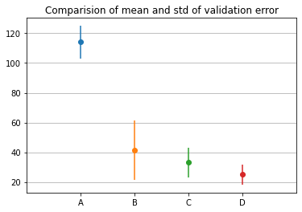

# Coursera-Projects

Project summaries

## Project 1 - Predict loan status (in collection or paid-off) 
Performed various feature extraction / creation / selection tasks on a combination of categorical and continuous features. 
Built machine learning classification models like Logistic regression, K nearest neighbours, Desicion Trees and Support Vector Machines and compared their performance.

Results:
| Model             |Jaccard	|F1-score	|LogLoss |
|-------------------|---------|---------|--------|
|KNN	              |0.7714	  |0.7695	  |NA      |
|Decision Tree	    |0.7540	  |0.7687	  |NA      |
|SVM	              |0.7580	  |0.6648	  |NA      |
|Logistic Regression|0.7514	  |0.6448	  |0.5583  |

## Project 2 - Predict strength of concrete  
Built various regression models by varying network parameters such as feature normalization, number of epochs, number of hidden layers, etc and compared thir performance. 

Results:
| Part | Network architecture   | Epochs |Feature Normalization |Mean validation error |Inference |
|------|------------------------|--------|----------------------|----------------------|--|
| A    | [input, 10, 1]         |51      |Un-normalized         |-                     |-  |
| B    | [input, 10, 1]         |51      |Normalized            |36% of A              |Normalizing the data greatly increases the efficiency of optimization|
| C    | [input, 10, 1]         |100     |Normalized            |80% of B              |Increasing the number of epochs brings us closer to the optimal weights|
| D    | [input, 10, 10, 10, 1] |51      |Noramlized            |61% of B              |Increasing the number of hidden layers is much more effecient than increasing the number of epochs|

## Project 3 - Identify images if concrete with cracks in them
Built image classification networks using ResNet50 and VGG16 and compared their performance. 

Results:
Performance of classifier using ResNet50 pre-trained model:
Loss     : 0.0024
Accuracy : 1.0

Performance of classifier using VGG16 pre-trained model:
Loss     : 0.0122
Accuracy : 0.998
